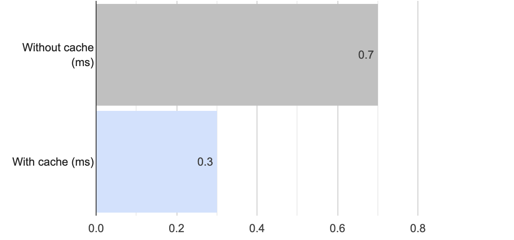

# RspecLetCache
This gem permits to cache rspec test values used/shared across tests and thus, it reduces dramatically the time to run involved tests.

Results for "features" example:


## Installation
Add this line to your application's Gemfile:

```ruby
group :test do
  gem 'rspec_let_cache'
end
```

And then execute:
```bash
$ bundle install
```

Load dependency to be available in your tests
```ruby
# spec/spec_helper.rb
require 'rspec_let_cache'
```

## Structure
  ```
  let_cache(<variable_name>){ 
    block to calculate value
    return calculated value
  }
  ```
  The first time `variable_name` is called, then the block to calculate value is evaluated and saved as a cache value. 
  The next time the variable is called, then it returns the corresponding cached value.

## Examples
### Reusing controller response
```ruby
describe 'when checking response content', type: :controller do
  render_views
  let_cache(:articles_cached) do
    [Article.create!(title: 'article 1'), Article.create!(title: 'article 2')]
  end
  let_cache(:response_cached) do
    articles_cached
    get :index
    response
  end

  it 'includes first article\'s title' do
    expect(response_cached.body).to include(articles_cached.first.title)
  end

  it 'includes second article\'s title' do
    expect(response_cached.body).to include(articles_cached.second.title)
  end
end    
```

### Reusing features page content
```ruby
describe 'index page', type: :feature do
  let_cache(:articles_cached) do
    [Article.create!(title: 'article 1'), Article.create!(title: 'article 2')]
  end
  let_cache(:page_cached) do
    articles_cached
    visit articles_path
    page
  end
  before { allow(page_cached).to receive(:reset!) } # Make capybara page to be reusable
  
  describe 'when checking page content' do
    it 'includes first article' do
      expect(page_cached).to have_content(articles_cached.first.title)
    end
  
    it 'includes second article' do
      expect(page_cached).to have_content(articles_cached.second.title)
    end
  
    it 'includes button to delete' do
      expect(page_cached).to have_css('#articles_table .edit_button')
    end
  end
end
```
  Note: Articles page is visited just one time.

## Contributing
Contribution directions go here.

## License
The gem is available as open source under the terms of the [MIT License](https://opensource.org/licenses/MIT).
